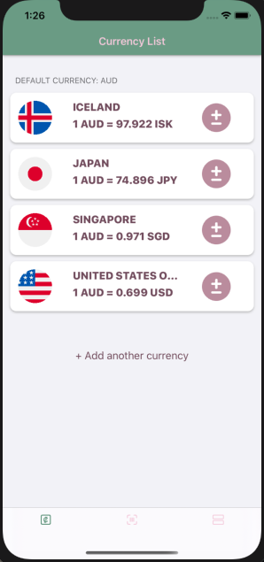

# README

This app was created to as a side project to demonstrate my understanding to iOS development.
MVC design pattern was used to separate the concerns of different application logics, and Object Oriented Principles SOLID was followed.

The app uses latest core technology frameworks from Apple, such as:
- Vision framework, for text detection and analysis; 
- CoreData, for creating persistent database storage;
- CoreLocation, to analyze device location
- AVFoundation, to access the video capturing device and process the output

The app also contains webservice which uses data fetched from an open source API.

App was designed carefully with selected light color schemes to improve unique branding, and little in-touch animations during splash screen and on tabbar tap, to demonstrate a lively application that is ready to be used.

## About The App Design
Currency Conversion Scanner is an iOS application meant for travelers aboard. 

The app has several functionalities that can help travelers to identify the price of a product in their own preset currency by using the camera of the device to scan the price tag of the product. The purpose is to allow easy currency translation, to give the shopper an idea how much a particular product costs in his/her currency, without involving much calculations and math. 

The app allows the user to change the preset currency at any time, for their convenience sake. The user will be able to add a list of currencies to the saved list, which display real-time foreign exchange data.

### Target Audience
Travelers aboard; Users looking for simplicity; Elderly not good with devices.

### Key Functionalities
- Camera Currency Live Capture / Conversion
- Foreign Exchange Saved List
- Offline Exchange Rate Support

## TODO
- Implement List of Saved Past Scan Results
- Implement Conversion Calculator
- Implement Foreign Exchange Historical Chart

## Credit
Added in application's about page.
